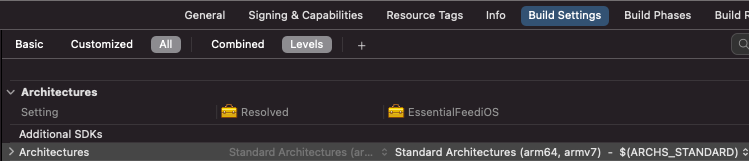
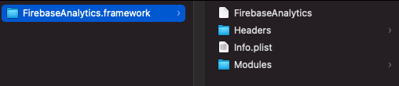
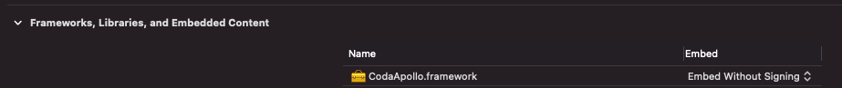

## Introduction

When building apps on any platform (applies to Apple platforms too), we have to deal with system frameworks, packaging our own code, using 3rd party code and many more. I've seen quite a few developers that work with static and / or dynamic frameworks / libraries, but don't fully understand them, and thus, can't get the best out of them. So I decided to share my knowledge into this article.

Let's take a quick look at how I structured this info:

- Definitions: what is a library, what is a framework, what is linking, what does static linking and dynamic linking mean
- iOS and macOS differences
- Implications of choosing static vs dynamic on app binary size and launch time (Part 2)
- The most common ways to integrate 3rd party code and how static vs dynamic linking applies to them (Part 2)
- Summary (Part 2)

Before diving in, let's clear up the terminology we use: we will refer to libraries as frameworks from a point of view of packaging and linking.

Another angle of looking at library vs framework looks at flow control: *your code call libraries, frameworks call your code (after registering with them).* 
We don't care much about this second interpretation for now.

## What is a library

[A library](https://en.wikipedia.org/wiki/Library_(computing)) is a collection of non-volatile resources used by computer programs. This can include source code. 
Most of the libraries we have seen for macOS or iOS contain code (compiled for one or more architectures).
Libraries can be linked statically (called static libraries) or dynamically (dynamic libraries). We'll look at what linking means in a few.

#### Examples

Static libraries usually look like `lib*.a` files, for example: `libGoogleAnalytics.a ` (you might have used this one).
Dynamic libraries use the `*.dylib` extension.

### What is the (CPU) architecture

In the context of iOS / macOS compiled binaries, the architecture refers to the [CPU architecture](https://docs.elementscompiler.com/Platforms/Cocoa/CpuArchitectures/). We need to compile our binaries for all the different CPU architectures they will be used on.

Currently, macOS has support for two architectures:

- `x86_64` the architecture of Intel's 64-bit CPUs. It is the architecture for all Intel Macs shipped between 2005 and 2021.
- `arm64` is the architecture used by newer Macs built on Apple Silicon (2020+).

iOS simulators run on macOS, so they use the same architectures.

iOS supported more architectures over time:

- Old iOS devices shipped before 2009 had `armv6` CPUs, which are no longer supported by current iOS SDKs
- `armv7` an older variation of the 32-bit ARM CPU, as used in the A5 and earlier.
- `armv7s` being used in Apple's A6 and A6X chips on iPhone 5, iPhone 5C and iPad 4
- `arm64` is the current 64-bit ARM CPU architecture, as used since the iPhone 5S and later (SE, 6, 7, ...), the iPad Air, Air 2 and Pro, with the A7 and later chips.

You can see the architecture(s) set for an Xcode target by looking at Build Settings -> Architectures (`ARCHS`). It's preset by Xcode to `Standard Architectures` (on Xcode 12.5 and an iOS target, this resolves to `arm64 armv7`).



## What is a framework

[A framework](https://en.wikipedia.org/wiki/Software_framework) is a package that can contain resources such as precompiled code (libraries), string files, images, storyboards etc. (if it contains other frameworks, it's called an _umbrella framework_).
Apple's frameworks are organized into bundles (have a predefined folder structure on disk). They can be accessed via `Bundle` class from code and, unlike most bundle files, can be browsed in the file system (easy for developers to inspect the contents). 

Check out [Apple's Bundle Programming Guide](https://developer.apple.com/library/archive/documentation/CoreFoundation/Conceptual/CFBundles/BundleTypes/BundleTypes.html#//apple_ref/doc/uid/10000123i-CH101-SW1).



*Frameworks* are also bundles ending with `.framework` extension. 
Note: Apple recently (Xcode 11) added `xcframework` extensions, also bundles with multiple architectures and platforms.

#### Static framework

A framework that embeds a static library has to be linked statically, so we call it a static framework.

#### Dynamic framework

A framework that embeds a dynamic library has to be linked dynamically, so we call it a dynamic framework.

#### Example

They all look like `*.framework` folders, for example: `FirebaseAnalytics.framework ` (you might have used this one).

## Linking

[A **linker** or **link editor**](https://en.wikipedia.org/wiki/Linker_(computing)) is a program that takes one or more object files (generated by a compiler or an assembler) and combines them into a single executable file, library file, or another "object" file.

Usually, the linking phase happens right after the compilation phase, and even if they are different and executed by separate components, we simplify by referring to both processes together as "compiling" or "building".

If you look at a build log, you'll see that a section like "Build target MyApp" contains several steps, one is probably "Compile Swift source files" and soon comes "Link MyApp" (if you expand the Link command, you'll see a `Ld ...` long command).

## Dynamic linking

Many OS environments allow dynamic linking, deferring the resolution of some undefined symbols until a program is run.
Shortly, dynamic linking means adding references to a binary (your app) to another module (library / framework). This dependency will be provided and resolved at runtime.
This is the way most system frameworks work - when building your app with `UIKit`, the binary references `UIKit` but doesn't include its symbols. The system "knows" a version of `UIKit` will be available at runtime (and uses dyld to load it). This version is shared by all apps and is delivered as part of the OS.

Of course, there is a possibility the referenced binary doesn't exist on the system, so trying to resolve it will result in a crash.
I haven't seen this happen on iOS or macOS, but people using Windows may remember the `msvcrt.dll was not found` crash, especially when playing games :) (example of dynamic linking gone bad).

## Static linking

Static linking is the result of the linker copying all the module's (library / framework) routines used by the app into the executable.
An advantage of static linking is the linker can determine which symbols are needed by the app and only include these (instead of all the symbols from the module).

## Static and dynamic linking on iOS / macOS

Static linking on iOS / macOS is very similar to other platforms - the linker will copy all the symbols needed by an binary into that binary.

### Dynamic linking on macOS

Dynamic linking on macOS is also similar to other platforms, where the OS has shared dynamic libraries / frameworks and users can install their own dynamic modules too and share them between apps.

### Dynamic linking on iOS

On iOS, all the system modules are linked dynamically. Examples: `Foundation`, `UIKit`, `CoreGraphics`, `libsqlite`, ...

This means they are shared by all apps and each OS version has an embedded version of these modules.

What is different from other platforms is there is no way for a developer to install 3rd party modules in a shared location and use them from different apps. This is because apps run in a "Sandbox" and cannot install modules to other parts of the system. 

The impact of this limitation is that you can use dynamic modules, but you have to embed them in your app's binary.

#### Embed modules in the app binary

By choosing to embed a module in your app (Target - General - Frameworks, Libraries, and Embedded Content), you enable a `Embed Frameworks` Build Phase that copies the modules into your app binary (the `.app` will contain a `Frameworks` folder with them).



### How to find out if a library / framework (3rd party) is static or dynamic

If you are looking at a binary library / framework (perhaps it's precompiled by a 3rd party) and want to know if it's a static or dynamic binary, just use `file -I` on the binary.
Example (static framework) - static binaries are usually marked with ar archive or similar.

```
file FirebaseAnalytics.framework/FirebaseAnalytics 
FirebaseAnalytics.framework/FirebaseAnalytics: Mach-O universal binary with 2 architectures: [arm_v7:current ar archive] [arm64:current ar archive]
FirebaseAnalytics.framework/FirebaseAnalytics (for architecture armv7):	current ar archive
FirebaseAnalytics.framework/FirebaseAnalytics (for architecture arm64):	current ar archive
```

Example (dynamic framework) - usually mentioned dynamically linked

```
file SDWebImage.framework/SDWebImage              
SDWebImage.framework/SDWebImage: Mach-O universal binary with 2 architectures: [x86_64:Mach-O 64-bit dynamically linked shared library x86_64] [arm64:Mach-O 64-bit dynamically linked shared library arm64]
SDWebImage.framework/SDWebImage (for architecture x86_64):	Mach-O 64-bit dynamically linked shared library x86_64
SDWebImage.framework/SDWebImage (for architecture arm64):	Mach-O 64-bit dynamically linked shared library arm64
```

## Final thoughts

This should give you a better understanding on what libraries and frameworks are and how they are linked.
If you want to dive deeper, [Part 2 of this article](../../../2021/10/25/Advanced-static-vs-dynamic-libraries-and-frameworks.html) deals with more advanced concepts like the impact on dynamic / static linking on performance, how dependency managers deal with these and more.