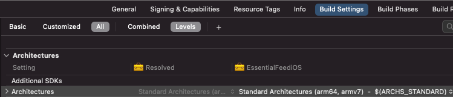
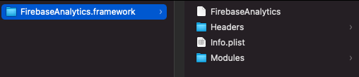

## Introduction

When building apps on any platform (applies to Apple platforms too), we have to deal with system frameworks, packaging our own code, using 3rd party code and many more. I've seen quite a few developers that work with static and / or dynamic frameworks / libraries, but don't fully understand them, and thus, can't get the best out of them. So I decided to share my knowledge into this article.

Let's take a quick look at how I structured this info:

- Definitions: what is a library, what is a framework, what is linking, what does static linking and dynamic linking mean
- iOS and macOS differences
- Implications of choosing static vs dynamic on app binary size and launch time
- The most common ways to integrate 3rd party code and how static vs dynamic linking applies to them
- Summary

## What is a library

[A library](https://en.wikipedia.org/wiki/Library_(computing)) is a collection of non-volatile resources used by computer programs. This can include source code. 
Most of the libraries we have seen for macOS or iOS contain code (compiled for one or more architectures).

#### Example

They look like `lib*.a` files, for example: `libGoogleAnalytics.a ` (you might have used this one).

### What is the (CPU) architecture

In the context of iOS / macOS compiled binaries, the architecture refers to the CPU architecture. We need to compile our binaries for all the different CPU architectures they will be used on.

Currently, macOS supports two architectures:

- `x86_64` the architecture of Intel's 64-bit CPUs. It is the architecture for all Intel Macs shipped between 2005 and 2021.
- `arm64` is the architecture used by newer Macs built on Apple Silicon (2020+).

iOS simulators run on macOS, so they use the same architectures.

iOS supported more architectures over time:

- Old iOS devices shipped before 2009 had `armv6` CPUs, which are no longer supported by current iOS SDKs
- `armv7` an older variation of the 32-bit ARM CPU, as used in the A5 and earlier.
- `armv7s` being used in Apple's A6 and A6X chips on iPhone 5, iPhone 5C and iPad 4
- `arm64` is the current 64-bit ARM CPU architecture, as used since the iPhone 5S and later (SE, 6, 7, ...), the iPad Air, Air 2 and Pro, with the A7 and later chips.

You can see the architecture(s) set for an Xcode target by looking at Build Settings -> Architectures (`ARCHS`). It's preset by Xcode to `Standard Architectures` (on Xcode 12.5 and an iOS target, this resolves to `arm64 armv7`).



## What is a framework

[A framework](https://en.wikipedia.org/wiki/Software_framework) is a package that can contain resources such as precompiled code(libraries), string files, images, storyboards etc. (if it contains other frameworks, it's called an _umbrella framework_).
Apple's frameworks are organized into bundles (have a predefined folder structure on disk). They can be accessed via `Bundle` class from code and, unlike most bundle files, can be browsed in the file system (easy for developers to inspect the contents). 

Check out [Apple's Bundle Programming Guide](https://developer.apple.com/library/archive/documentation/CoreFoundation/Conceptual/CFBundles/BundleTypes/BundleTypes.html#//apple_ref/doc/uid/10000123i-CH101-SW1).



*Frameworks* are also bundles ending with `.framework` extension. 
Note: Apple recently (Xcode 11) added `xcframework` extensions, also bundles with multiple architectures and platforms.

#### Example

They look like `*.framework` folders, for example: `FirebaseAnalytics.framework ` (you might have used this one).

## Linking

[A **linker** or **link editor**](https://en.wikipedia.org/wiki/Linker_(computing)) is a program that takes one or more object files (generated by a compiler or an assembler) and combines them into a single executable file, library file, or another "object" file.

Usually, the linking phase happens right after the compilation phase, and even if they are different and executed by separate components, we simplify by refering to both processes together as "compiling" or "building".

## Dynamic linking

Many OS environments allow dynamic linking, deferring the resolution of some undefined symbols until a program is run.
Shortly, dynamic linking means adding references to a binary (your app) to another module (library / framework). This dependency will be resolved at runtime.
This is the way most system frameworks work - when building your app with `UIKit`, the binary references `UIKit` but doesn't include it's symbols. The system "knows" a version of `UIKit` will be available at runtime. This version is shared by all apps and is delivered as part of the OS.

Of course, there is a possibility the referenced binary doesn't exist on the system, so trying to resolve it will result in a crash.
I haven't seen this happen on iOS or macOS, but people using Windows may remember the `msvcrt.dll was not found` crash, especially when playing games :) (example of dynamic linking gone bad).

## Static linking

Static linking is the result of the linker copying all the module's (library / framework) routines used by the app into the executable.
An advantage of static linking is the linker can determine which symbols are needed by the app and only include these (instead of all the symbols from the module).

## Static and dynamic linking on iOS / macOS

Static linking on iOS / macOS is very similar to other platforms - the linker will copy all the symbols needed by an binary into that binary.

### Dynamic linking on macOS

Dynamic linking on macOS is also similar to other platforms, where the OS has shared dynamic libraries / frameworks and users can install their own dynamic modules too and share them between apps.

### Dynamic linking on iOS

On iOS, all the system modules are linked dynamically. Examples: `Foundation`, `UIKit`, `CoreGraphics`, `libsqlite`, ...

This means they are shared by all apps and each OS version has an embedded version of these modules.

What is different from other platforms is there is no way for a developer to install 3rd party modules in a shared location and use them from different apps. This is because apps run in a "Sandbox" and cannot install modules to other parts of the system. 

The impact of this limitation is that you can use dynamic modules, but you have to embed them in your app's binary.

#### Embed modules in the app binary

By choosing to embed a module in your app (Target - General - Frameworks, Libraries, and Embedded Content), you enable a `Embed Frameworks` Build Phase that copies the modules into your app binary (the `.app` will contain a `Frameworks` folder with them).


### How to find out if a library / framework (3rd party) is static or dynamic

If you are looking at a binary library / framework and want to know if it's a static or dynamic binary, just use `file -I` on the binary.
Example (static framework) - static binaries are usually marked with ar archive or similar.

```
file FirebaseAnalytics.framework/FirebaseAnalytics 
FirebaseAnalytics.framework/FirebaseAnalytics: Mach-O universal binary with 2 architectures: [arm_v7:current ar archive] [arm64:current ar archive]
FirebaseAnalytics.framework/FirebaseAnalytics (for architecture armv7):	current ar archive
FirebaseAnalytics.framework/FirebaseAnalytics (for architecture arm64):	current ar archive
```

Example (dynamic framework) - usually mentioned dynamically linked

```
file SDWebImage.framework/SDWebImage              
SDWebImage.framework/SDWebImage: Mach-O universal binary with 2 architectures: [x86_64:Mach-O 64-bit dynamically linked shared library x86_64] [arm64:Mach-O 64-bit dynamically linked shared library arm64]
SDWebImage.framework/SDWebImage (for architecture x86_64):	Mach-O 64-bit dynamically linked shared library x86_64
SDWebImage.framework/SDWebImage (for architecture arm64):	Mach-O 64-bit dynamically linked shared library arm64
```

## Summary of static vs dynamic linking

| Type of linking and platform / Impact | App Size                                                     | App Start Time                                               |
| ------------------------------------- | ------------------------------------------------------------ | ------------------------------------------------------------ |
| Static linking - iOS and macOS        | Smaller app size than using dynamic embedded modules (per compiler optimisation).<br />Of course, in the case of dynamically linked modules shared between apps (like on macOS), the app binary size will be the smallest, so compared to that, static linking results in a bigger app binary. | Fastest - loading non-system dynamic frameworks is pretty expensive (system frameworks are optimized). When using static linking, all the symbols are within the same module, so the app start is fast. |
| Dynamic linking - iOS                 | Larger binary than when using statically linked modules, since the compiler can't do the optimizations of excluding not used symbols). | This is a known issue: loading dynamic modules is expensive, especially at start time. Apple recommended in WWDC to use a max of 6 dynamic frameworks. See details in ....... |
| Dynamic linking - macOS               | If choosing to share those dynamic modules (via installer) or other way and not embed them in the app binary, the app size will be smaller, otherwise it's the same as above (for iOS). | I didn't find any reference of a limit of dynamic frameworks for macOS apps, probably because Macs have better hardware and this is no longer an issue. But even here, static linking will probably result in a quicker app start. |

## When to use dynamic linking

So if statically linked modules result in a smaller app size and are faster at loading, why would we want to use dynamically loaded modules?

Here are a few situations.

### Sharing libraries / frameworks on macOS

When you want to share the same binary (library / framework) between multiple apps, you can install it in a shared location and use it as any other system dynamic module.

### Multiple static modules depending on the same module

Let's say you have a module (your own or 3rd party) named `Common` that is used by other modules in your app.
`FeatureA` -> `Common` and `FeatureB` -> `Common`.
If `FeatureA`, `FeatureB` and `Common` are static libraries / frameworks, you'll see a warning at app runtime in the console `duplicate symbol MY_COMMON_SYMBOL in ... FeatureA and ... FeatureB`. This happens because when linking statically to `Common`, both `FeatureA` and `FeatureB` binaries will contain the symbols from `Common`. So at runtime, the loader will not know which one is should use.

In this case, unless you have other things to consider, making `Common` a dynamic module will solve the problem, as both `FeatureA` and `FeatureB` will just reference `Common`, expecting at runtime to find an implementations for its symbols.

## iOS increased app launch time start when using many dynamic libs / frameworks

I've mentioned using many 3rd party dynamic libraries / frameworks probably leads to an increased app launch time on iOS.

This was detailed in WWDC 2016 Session 406 - Optimizing App Startup Time (I can only find the transcript of that session on [asciiwwdc](https://asciiwwdc.com/2016/sessions/406). Apple explained how each dynamic module adds to the total app launch time and we should keep the number of dynamic modules to a max of 6.
See [Apple's Reducing Your App’s Launch Time article](https://developer.apple.com/documentation/xcode/reducing-your-app-s-launch-time/) that mentiones all of that, except for an exact number of dynamic frameworks (perhaps over time the 6 limit became harder to keep and, since hardwares evolved, the limit might have increased).

The matter is simple: just test it out. Older Xcode versions required adding `DYLD_PRINT_STATISTICS` to the ENV variables to print stats regarding the app launch time and how much each step took. See [Apple's Logging Dynamic Loader Events](https://developer.apple.com/library/archive/documentation/DeveloperTools/Conceptual/DynamicLibraries/100-Articles/LoggingDynamicLoaderEvents.html).
Looks like this:

```
Total pre-main time:  95.07 milliseconds (100.0%)
         dylib loading time:  25.00 milliseconds (26.3%)
        rebase/binding time:  19.75 milliseconds (20.7%)
            ObjC setup time:   6.85 milliseconds (7.2%)
           initializer time:  43.45 milliseconds (45.7%)
           slowest intializers :
             libSystem.B.dylib :   8.43 milliseconds (8.8%)
   libBacktraceRecording.dylib :   9.00 milliseconds (9.4%)
    libMainThreadChecker.dylib :  22.05 milliseconds (23.1%)
```

Or you can use Instruments, as explained in [Apple's Reducing Your App’s Launch Time article](https://developer.apple.com/documentation/xcode/reducing-your-app-s-launch-time/).

One thing to consider is something called Cold Start vs Warm Start. A cold start is when you app starts for the 1st time (after a phone reboot) and is usually the slowest start. After that, even if you close the app, the system will cache some of the memory footprint (in case you closed the app by mistake). The next time you start the app will be a faster, warm start.
So to measure reliably, measure your app launch after a phone reboot (cold start).

If you find your app is taking a long time starting (Apple recommended 500 miliseconds for a seamless user experience), take a look at what is holding your app from launching. It can be many things, as executing some code on the `AppDelegate` or `SceneDelegate` methods, having a huge Launch storyboard, ... If the problem lies with `dylib loading time`, you can look into changing some dynamic libraries / frameworks to static ones.

## Static / dynamic with different integrations techniques

Since nowadays many projects have a lot of 3rd party dependencies, let's look at how these dependency managers work and how we can control their linking related behavior.

### Own targets or projects linked directly

If the targets are in your repo or in other repos, but are linked to your project, you can go in and change the way they are built and linked through Build Settings.

You just need to change the value of the `MACH_O_TYPE` Build Setting between Static Library (`staticlib`) and Dynamic Library (`mh_dylib`).

To change between a library and a framework, you need to change the type of Product the target outputs (not sure how to do that from settings).


### CocoaPods

By default, CocoaPods (no mention of `use_frameworks!`) will build and link all the dependencies as static libraries.

If we add `use_frameworks!` to our Podfile, CP will instead build and link the dependencies as dynamic frameworks.

We can use `use_frameworks! :linkage => :static` to make CP build and link dependencies as static frameworks.

NOTE: of course, all these apply to dependencies that CocoaPods builds from sources. If you are referencing a pod that is precompiled, there is no way for CocoaPods to change how that pod is packaged. Most packages distributed as precompiled binaries will be static libraries or static frameworks.

### Swift Package Manager

SPM does not allow any control over how the dependencies are build and linked - they are all static libraries.
You can, however, specify how to build your own packages via `Package.swift` where you can specify `type: .dynamic`, but of course, this works only if you are the maintainer of that package.

### Carthage

By default, Carthage uses dynamic frameworks to build your dependencies, but there is an option to change them to be static.

## References

https://docs.elementscompiler.com/Platforms/Cocoa/CpuArchitectures/